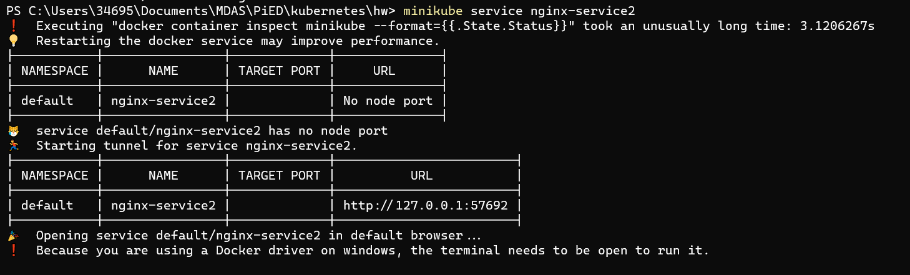

# Ejercicio 3

Objeto Service para exponer la aplicacion del ejercicio 2:

- Exponiendo el servicio hacia fuera:

En este casa el service debe estar configurado en modo LoadBalancer.

Si hacemos un
**kubectl describe serivce nginx-service1** y **kubectl get pods** podemos ver el servicio y que actualmente tiene 3 pods relacionados
La ip de los pods coindice con la de los servicios.

Una vez tenemos el servicio running accedemos a este servicio y nos abrira directamente la ip donde se ejecuta el service:
**minikube service nginx-service2**

En este caso como estamos trabajando com minikube en local, no nos proporciona una ip externa "de verdad". 
Para solventar este caso se deberia utilizar algun proveedor tipo AWS

---------------------

- De forma interna, sin acceso desde el exterior

En este caso el service esta en modo cluester ip.

Si hacemos un
**kubectl describe serivce nginx-service2** y **kubectl get pods** podemos ver el servicio y que actualmente tiene 3 pods relacionados
La ip de los pods coindice con la de los servicios

Una vez tenemos el servicio running accedemos a este servicio y nos abrira directamente la ip donde se ejecuta el service:
**minikube service nginx-service2**

------------------------

- Abriendo un puerto especifico de la VM

En este caso el service esta en modo NodePort.

Si hacemos un
**kubectl describe serivce nginx-service2** y **kubectl get pods -o wide** podemos ver el servicio y que actualmente tiene 3 pods relacionados
La ip de los pods coindice con la de los servicios

Una vez tenemos el servicio running accedemos a este servicio y nos abrira directamente la ip donde se ejecuta el service:
**minikube service nginx-service2**

