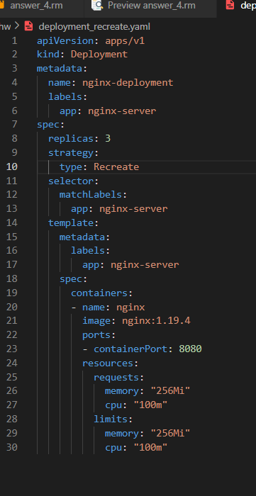
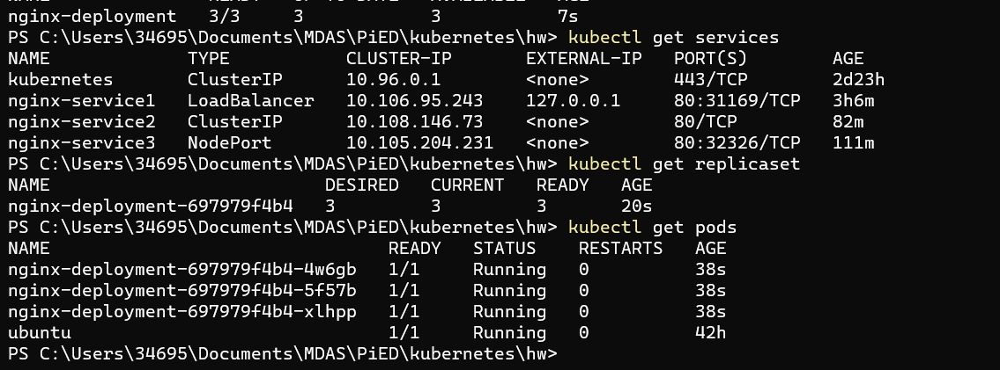
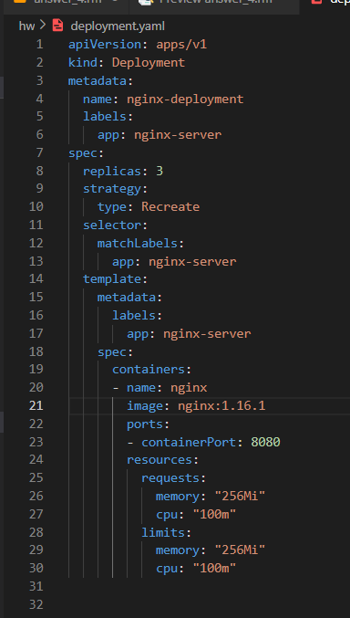
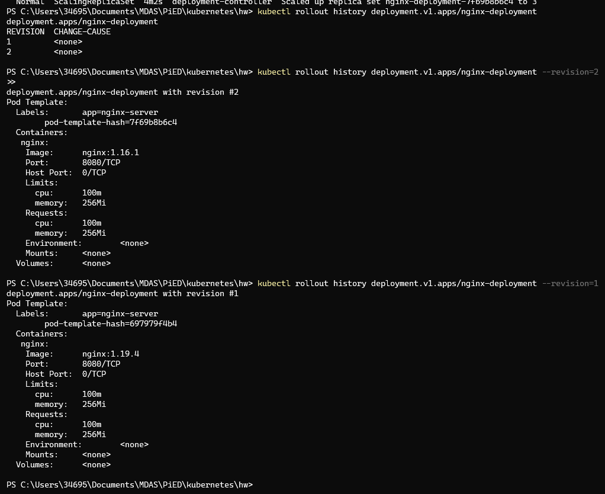
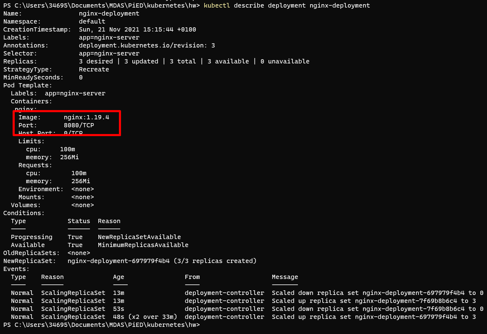

# Ejercicio 4

Configuracion del deployment.yaml
 

Revisamos la creacion del deploy:

Una vez tengo el deployment listo, voy a cambiar en el archivo yaml la imagen de nginx y voy a hacer un rollout deployment.

Con el comando 
**kubectl rollout status deployment nginx-deployment** puedo ir viendo como se hace el rollout

Una vez tenemos el cambio podemos ver en el deploy que se han realizado los updates:

En este punto, podemos hacer un rollback para poder volver al estado princial del deploy.
Primero podemos ver el historial del deploy y los cambios realizados con los comandos:
**kubectl rollout history deployment nginx-deployment**
**kubectl rollout history deployment nginx-deployment --revision=number**

Una vez tenemos la nueva version, podemos volver a la primera revision con el comando:
**kubectl rollout undo deployment nginx-deployment --to-revision=1**
En este caso le paso la revision 1, pero puede ser el numero de revision que queramos.

Una vez hecho el undo, si hacemos un describe del deploy, podemos ver que sus contenedores vuelven a tener la version 1 de la imagen de nginx.

