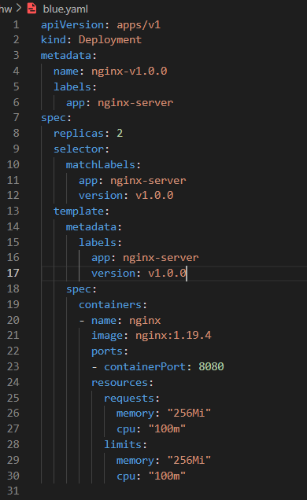
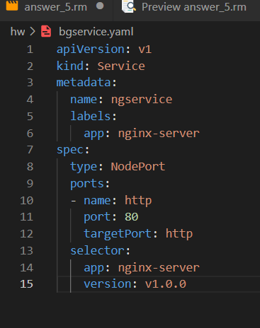
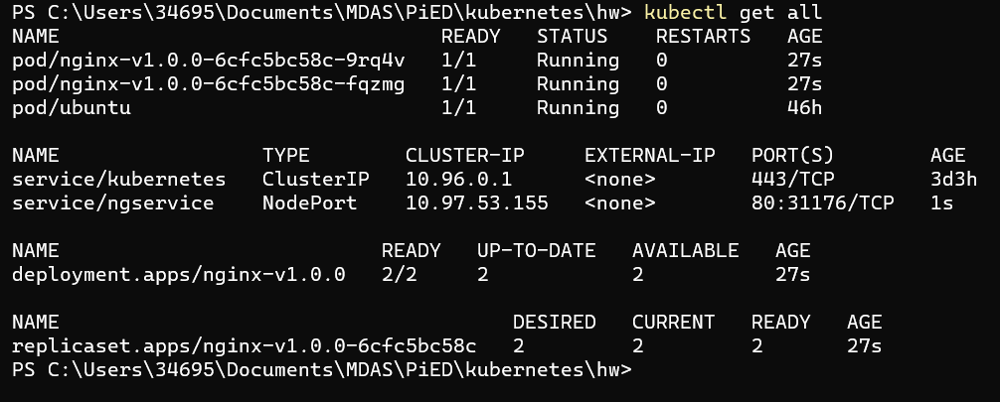
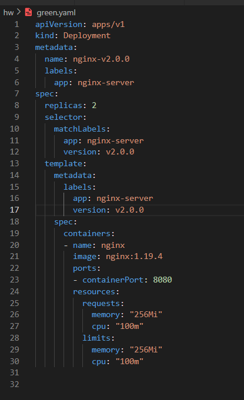

# Ejercicio 5

Para recrear el escenario de este ejercicio he creado un deployment y un service en específico:

Este deploy tiene como selector la versión 1 de la aplicación

Este service tiene como selector la versión 1 de la aplicación, para saber donde redirigir el tráfico

Una vez tenemos desplegado el escenario, vamos a levantar una segunda versión de nuestra aplicación.
En este caso la única diferencia es el selector que le ponemos a nuestros pods, que en este caso es la versión 2 de la aplicación.

Ahora tenemos la aplicación con la v2 correindo y podemos hacer las pruebas necesarias.
Una vez hayamos acabado el testing de la nueva version de la aplicación, podemos redirigir el tráfico de la versión 1 a la versión 2 de la aplicaión.

Para hacerlo podemos utilizar el comando:
**kubectl patch service ngservice -p '{"spec":{"selector":{"version":"v2.0.0"}}}'**

De esta manera le cambiamos al servicio la version del selector.

A partir de ahora, el trafico esta por la versión 2 de la aplicación y podemos eliminar el deploy 1 en este caso con el comando:
**kubectl delete deploy nginx-v1.0.0**
